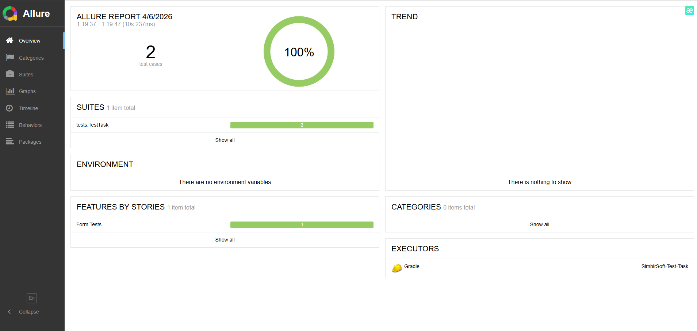
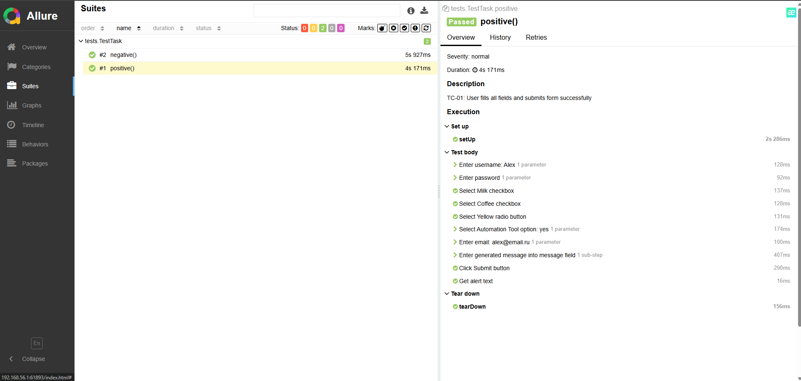
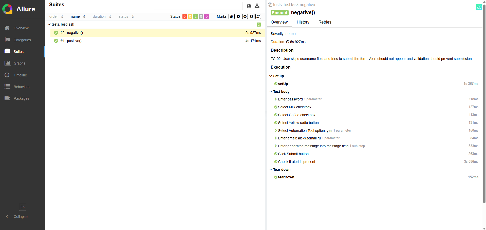

# Тестовое задание для SDET-практикума

UI-автотесты для формы https://practice-automation.com/form-fields

## Технологии

- Язык: Java 21
- Иструменты: Gradle, Selenium, JUnit5, Allure
- Паттерны: Page Object Model (POM), Factory, Fluent.

## Тест-кейсы

### Предусловие:

1. Открыть браузер
2. Перейти по ссылке https://practice-automation.com/form-fields/

### TC-001: Позитивный тест

1. Заполнить поле **Name**.
2. Заполнить поле **Password**.
3. Выбрать **Milk** и **Coffee** из списка "**What is your favorite drink?**"
4. Выбрать **Yellow** из списка "**What is your favorite color?**"
5. В поле **Do you like automation?** выбрать "**Yes**"
6. Заполнить поле **Email** строкой формата **name@example.com**
7. В поле **Message** написать:
    - Количество инструментов, описанных в пункте **Automation tools**
    - Инструмент из списка **Automation tools**, содержащий наибольшее количество символов
8. Нажать кнопку **Submit**.

**Ожидаемый результат:** Появляется алерт с текстом Message received!

### TC-002: Негативный тест-кейс:

1. Заполнить поле **Password**.
2. Выбрать **Milk** и **Coffee** из списка "**What is your favorite drink?**"
3. Выбрать **Yellow** из списка "**What is your favorite color?**"
4. В поле **Do you like automation?** выбрать "**Yes**"
5. Заполнить поле **Email** строкой формата **name@example.com**
6. В поле **Message** написать:
    - Количество инструментов, описанных в пункте **Automation tools**
    - Инструмент из списка **Automation tools**, содержащий наибольшее количество символов
7. Нажать кнопку **Submit**.

**Ожидаемый результат:** Не появляется алерт.

## Скриншоты отчета о пройденных тестах через Allure

